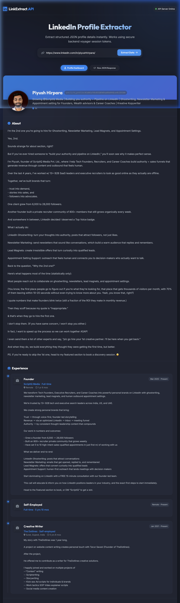

# 🔗 LinkedIn Profile Extractor API

A production-grade hosted API service and interactive dashboard that reverse engineers LinkedIn's internal web API ("Voyager") using session cookies. It extracts rich, structured JSON details from public LinkedIn profile URLs (including names, headlines, summary, experiences, education, skills, certifications, and languages).

---

## ✨ Features
*   **Structured JSON Output:** Sanitizes and transforms complex, deeply nested LinkedIn responses into a clean, normalized schema.
*   **Dual Interface:** Access the API programmatically via `/api/v1/profile` or test it using the built-in modern, glassmorphism dark-mode UI dashboard.
*   **Full Profile Coverage:** Extracts name, headline, location, summary, experiences, education, skills, certifications, languages, and profile/company logos.
*   **Dockerized Setup:** Fully containerized for easy deployment to cloud services.
*   **Automatic API Documentation:** Exposes Swagger UI docs at `/docs`.

---

## 📸 Dashboard Preview



The application bundles a beautiful frontend dashboard at the root URL (`/`) when running the server:
*   Allows pasting any LinkedIn URL.
*   Shows real-time loading steps (Connecting, Fetching, Normalizing).
*   Visualizes experience and education in clean timelines.
*   Renders skills as modern interactive pills.
*   Includes a Raw JSON payload tab with a copy-to-clipboard button.

---

## 🔒 Session Cookie Extraction Guide

Since LinkedIn profile pages are protected by bot-detection layers, this tool utilizes session cookies (`li_at` and `JSESSIONID`) from a logged-in session to authenticate queries directly against LinkedIn's internal endpoints.

> [!WARNING]
> **Account Ban warning:** Automated scraping violates LinkedIn's User Agreement. Using your personal LinkedIn cookies carries a risk of account restriction if abused. **We strongly recommend using a test/secondary LinkedIn account.**

To extract your cookies:
1.  Log in to [LinkedIn](https://www.linkedin.com) in your web browser.
2.  Right-click anywhere and choose **Inspect** (or press `F12` / `Ctrl+Shift+I` / `Cmd+Opt+I`) to open Developer Tools.
3.  Go to the **Application** tab (Chrome) or **Storage** tab (Firefox).
4.  In the left sidebar, expand **Cookies** and select `https://www.linkedin.com`.
5.  Find and copy the values for:
    *   `li_at`: A long alphanumeric token that represents your active login session.
    *   `JSESSIONID`: A string (usually wrapped in double quotes) like `"ajax:1234567890123456789"`. Include the quotes when setting your environment variables.

---

## 🚀 Getting Started

### Method 1: Local Installation

**Prerequisites:** Python 3.10+ installed.

1.  **Clone the repository:**
    ```bash
    git clone <your-repo-url>
    cd Linkedin_API_extracter
    ```

2.  **Create and activate a virtual environment:**
    ```bash
    python3 -m venv .venv
    source .venv/bin/activate  # On Windows: .venv\Scripts\activate
    ```

3.  **Install dependencies:**
    ```bash
    pip install -r requirements.txt
    ```

4.  **Configure environment variables:**
    Copy `.env.example` to `.env` and fill in your extracted cookie credentials:
    ```bash
    cp .env.example .env
    ```
    Edit `.env`:
    ```env
    LI_AT=YOUR_COPIED_LI_AT_TOKEN
    JSESSIONID="ajax:YOUR_COPIED_JSESSIONID"
    PORT=8000
    ```

5.  **Run the FastAPI server:**
    ```bash
    uvicorn backend.main:app --reload
    ```
    *   Access the **Frontend UI Dashboard** at `http://localhost:8000/`
    *   Access the **Interactive Swagger Docs** at `http://localhost:8000/docs`

---

### Method 2: Docker Setup

1.  **Build the Docker image:**
    ```bash
    docker build -t linkedin-extractor .
    ```

2.  **Run the container:**
    Pass the cookies as environment variables at runtime:
    ```bash
    docker run -d -p 8000:8000 \
      -e LI_AT="your_li_at_cookie_here" \
      -e JSESSIONID='"ajax:your_jsessionid_here"' \
      linkedin-extractor
    ```
    Access the container dashboard at `http://localhost:8000/`.

---

## 📖 API Reference

### Extract Profile Data

*   **Endpoint:** `GET /api/v1/profile`
*   **Description:** Retrieves and normalizes profile data for a given LinkedIn URL.
*   **Query Parameters:**
    *   `profile_url` (string, required): The full LinkedIn profile URL (e.g. `https://www.linkedin.com/in/nakulmantri`).

#### Example Request
```bash
curl -X GET "http://localhost:8000/api/v1/profile?profile_url=https://www.linkedin.com/in/username"
```

#### Example JSON Response
```json
{
  "success": true,
  "data": {
    "profile_id": "username",
    "urn_id": "ACoAAB...",
    "first_name": "John",
    "last_name": "Doe",
    "full_name": "John Doe",
    "headline": "Lead Software Engineer | AI Researcher",
    "location": "San Francisco, California, United States",
    "summary": "Building scalable web APIs and machine learning systems...",
    "profile_picture_url": "https://media.licdn.com/dms/image/v2/.../profile-displayphoto-shrink_800_800/...",
    "profile_images": {
      "100_100": "https://media.licdn.com/dms/image/v2/.../profile-displayphoto-shrink_100_100/...",
      "200_200": "https://media.licdn.com/dms/image/v2/.../profile-displayphoto-shrink_200_200/...",
      "400_400": "https://media.licdn.com/dms/image/v2/.../profile-displayphoto-shrink_400_400/...",
      "800_800": "https://media.licdn.com/dms/image/v2/.../profile-displayphoto-shrink_800_800/..."
    },
    "contact_info": {
      "email": "johndoe@example.com",
      "websites": [
        {
          "url": "https://johndoe.dev",
          "label": "PERSONAL"
        }
      ],
      "twitter": [],
      "phone_numbers": []
    },
    "experience": [
      {
        "company": "Tech Corp",
        "company_url": "https://www.linkedin.com/company/123456",
        "company_logo_url": "https://media.licdn.com/dms/image/v2/.../company-logo_200_200/...",
        "title": "Lead Software Engineer",
        "location": "San Francisco, CA",
        "start_date": "2023-05",
        "end_date": "Present",
        "duration": "3 yrs 4 mos",
        "description": "Led backend architecture migration to FastAPI microservices."
      }
    ],
    "education": [
      {
        "school": "Stanford University",
        "school_url": "https://www.linkedin.com/school/1234",
        "school_logo_url": "https://media.licdn.com/dms/image/v2/.../school-logo_200_200/...",
        "degree": "M.S.",
        "field_of_study": "Computer Science",
        "start_date": "2021",
        "end_date": "2023",
        "description": "Specialization in artificial intelligence."
      }
    ],
    "skills": [
      "FastAPI",
      "Python",
      "Docker",
      "Machine Learning"
    ],
    "certifications": [
      {
        "name": "AWS Certified Solutions Architect – Professional",
        "authority": "Amazon Web Services (AWS)",
        "license_number": "AWS-123456",
        "url": "https://aws.amazon.com/...",
        "start_date": "2024-01",
        "end_date": "2027-01"
      }
    ],
    "languages": [
      {
        "name": "English",
        "proficiency": "NATIVE_OR_BILINGUAL"
      }
    ]
  }
}
```

---

## 🛠️ Approach & Architecture

1.  **Reverse Engineering Endpoint (`/profileView`):**
    The scraper communicates directly with LinkedIn's internal web API endpoint:
    `https://www.linkedin.com/voyager/api/identity/profiles/{public_id}/profileView`
    This returns a normalized profile graph payload containing almost all elements visible on the user's top card, experiences, education, certifications, and language views in a single network request.
2.  **Authentication & CSRF:**
    We configure a custom `requests.Session` populated with the user's `li_at` cookie. The backend automatically extracts the anti-CSRF token from the `JSESSIONID` and maps it to the `csrf-token` header required by all Voyager API requests.
3.  **Data Normalization Layer:**
    The API extracts vector roots and overlays individual dimensions (e.g. image segments, company objects, time intervals) to transform raw JSON strings into structured, client-friendly representations.
4.  **UI Integration:**
    To bypass potential CORS restrictions, the FastAPI server mounts the static web dashboard (`/static`) and serves the main layout at the root path (`/`).

---

## ⚠️ Known Limitations

*   **Session Expiration:** Since the tool relies on a browser session, the `li_at` cookie will expire over time (usually 3 to 12 months, or immediately if you manually log out of LinkedIn on the browser where you copied the cookie). When this happens, a new cookie must be generated.
*   **Out-of-Network Profiles:** If the authenticated profile (matching the credentials/cookies) does not have connection visibility to a private or highly restricted profile, the API might return restricted details (similar to what you see when viewing that profile as an out-of-network member on the browser).
*   **Anti-Bot Rate Limiting:** Making a high volume of requests within a short timeframe may trigger LinkedIn's security mechanisms. It is recommended to implement caching or rate-limiting if using this at scale.
